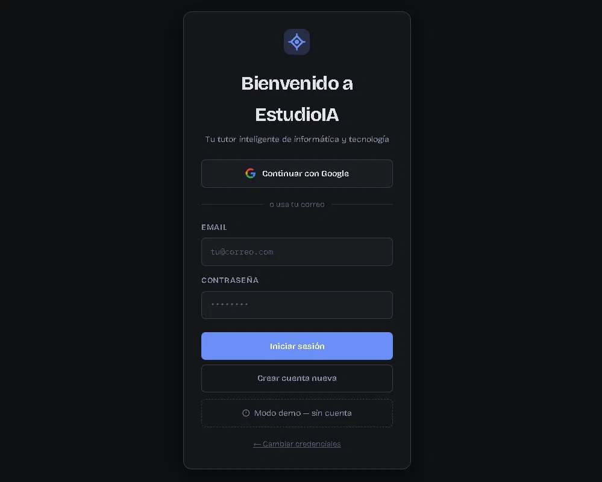
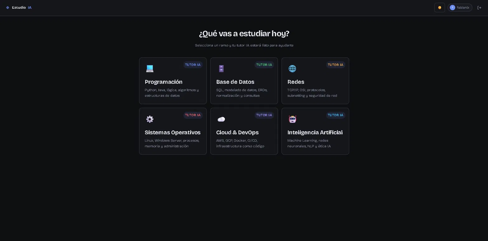
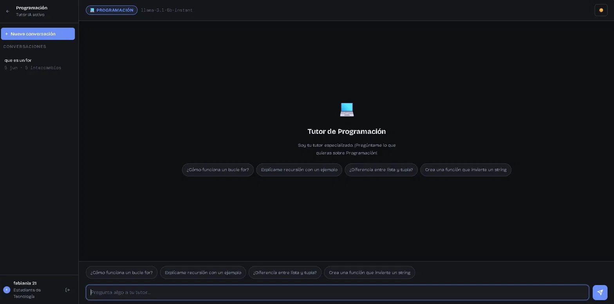
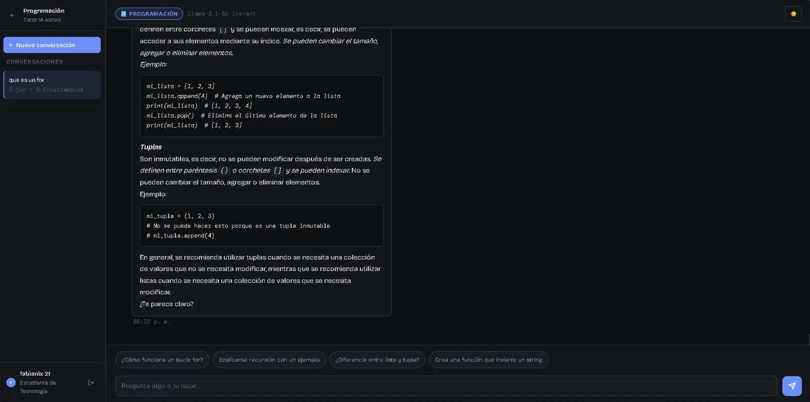
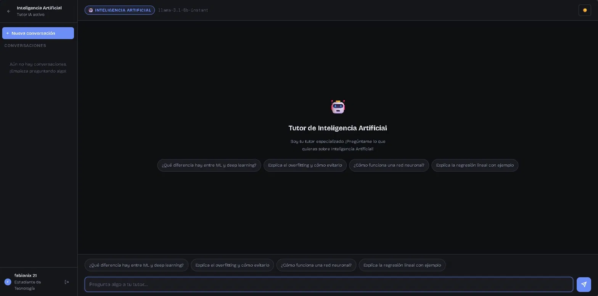

# 🤖 EstudioIA — Tu Tutor Inteligente de Tecnología

> Plataforma web de tutoría con IA especializada en áreas de informática y tecnología. Cada tutor está diseñado para guiar al estudiante con explicaciones claras, ejemplos de código y conversaciones contextuales en tiempo real.


---

## ✨ Características principales

- 🧠 **6 tutores especializados** — Programación, Base de Datos, Redes, Sistemas Operativos, Cloud & DevOps e Inteligencia Artificial
- 💬 **Chat contextual** — el tutor recuerda el hilo de la conversación y responde de forma coherente
- 📂 **Historial persistente** — las conversaciones se guardan por sesión, puedes retomar cualquier chat anterior
- 🔐 **Autenticación segura** — login con Google o correo/contraseña via Firebase Auth
- 🌙 **Modo oscuro/claro** — toggle de tema incluido
- 📱 **Responsive** — funciona en desktop y móvil
- ⚡ **Tiempo real** — respuestas en streaming sin recargar página

---

## 🛠️ Stack tecnológico

| Capa | Tecnología |
|------|-----------|
| Frontend | HTML5 + CSS3 + JavaScript (Vanilla) |
| IA | Groq API — Llama 3.1 8B Instant |
| Autenticación | Firebase Authentication |
| Base de datos | Supabase (PostgreSQL) |
| Hosting | Compatible con Vercel, Netlify o GitHub Pages |

---

## 🚀 Demo rápida

1. Clona o descarga el repositorio
2. Abre `EstudioIA.html` en tu navegador (o despliega en cualquier hosting estático)
3. En la pantalla de configuración ingresa tus credenciales
4. Elige un tutor y empieza a estudiar

> ⚠️ El proyecto funciona con **cualquier proveedor compatible con la API de OpenAI** (Groq, Together AI, Mistral, OpenAI, etc.) — solo cambia la URL y el modelo.

---

## 🔑 Credenciales necesarias

El proyecto solicita las credenciales en la pantalla de configuración al primer uso. **No se almacenan en ningún servidor externo**, solo en el `localStorage` del navegador.

| Credencial | Dónde obtenerla | Para qué sirve |
|-----------|----------------|----------------|
| Groq API Key | [console.groq.com/keys](https://console.groq.com/keys) | Llamadas al modelo de IA |
| Supabase URL + Key | [supabase.com](https://supabase.com) | Guardar historial de chats |
| Firebase Config | [console.firebase.google.com](https://console.firebase.google.com) | Login y autenticación |

---

## 📐 Arquitectura del proyecto

```
EstudioIA.html          ← Archivo único (SPA)
│
├── CONFIG & STATE       ← Estado global de la app
├── FIREBASE AUTH        ← Login Google / Email
├── SUPABASE             ← CRUD historial de mensajes
├── GROQ API             ← Llamadas al modelo LLM
├── CHAT LOGIC           ← Manejo de conversaciones
└── UI RENDERING         ← Renderizado de mensajes, markdown y código
```

---

## 💡 Decisiones técnicas destacadas

- **Single File App** — toda la aplicación en un solo archivo HTML para máxima portabilidad y facilidad de despliegue
- **Sin frameworks** — JavaScript vanilla puro, sin dependencias de npm ni proceso de build
- **Sesiones de conversación** — sistema de `session_id` para agrupar mensajes y permitir historial navegable
- **Markdown rendering** — las respuestas del tutor se renderizan con formato enriquecido y syntax highlighting para código
- **Context window** — se envían los últimos 10 mensajes al modelo para mantener coherencia en la conversación

---

## 📸 Capturas

### 🔐 Login


### 🎓 Selector de tutores


### 💬 Chat con historial de conversaciones


### 🧑‍💻 Respuesta con código formateado


### 🤖 Tutor de Inteligencia Artificial


---


---

## 🔄 Cambiar el proveedor de IA

El proyecto usa el estándar de API de OpenAI, compatible con múltiples proveedores. Para cambiar el modelo solo necesitas modificar **2 líneas** en `EstudioIA.html`:

Busca la función `callGemini` (línea ~1814) y cambia:

```javascript
// Línea 1: el modelo
model: 'llama-3.1-8b-instant',

// Línea 2: la URL del proveedor
const res = await fetch('https://api.groq.com/openai/v1/chat/completions', {
```

### Proveedores compatibles

| Proveedor | URL | Modelos recomendados | Plan gratuito |
|-----------|-----|---------------------|---------------|
| **Groq** _(default)_ | `https://api.groq.com/openai/v1/chat/completions` | `llama-3.1-8b-instant`, `mixtral-8x7b-32768` | ✅ Sí |
| **OpenAI** | `https://api.openai.com/v1/chat/completions` | `gpt-4o-mini`, `gpt-3.5-turbo` | ❌ No |
| **Together AI** | `https://api.together.xyz/v1/chat/completions` | `meta-llama/Llama-3-8b-chat-hf` | ✅ Sí |
| **Mistral** | `https://api.mistral.ai/v1/chat/completions` | `mistral-small-latest` | ✅ Sí |
| **OpenRouter** | `https://openrouter.ai/api/v1/chat/completions` | Cualquier modelo disponible | ✅ Sí |

> Todos usan el mismo formato de API — solo cambia la URL y el nombre del modelo. La API key del proveedor elegido va en la pantalla de configuración de la app.

## 👨‍💻 Autor

Desarrollado por **fabianix** · Estudiante de Informática y Telecomunicaciones  
[](https://github.com/TU_USUARIO)

---

## 📄 Licencia

MIT — libre para usar, modificar y distribuir.
